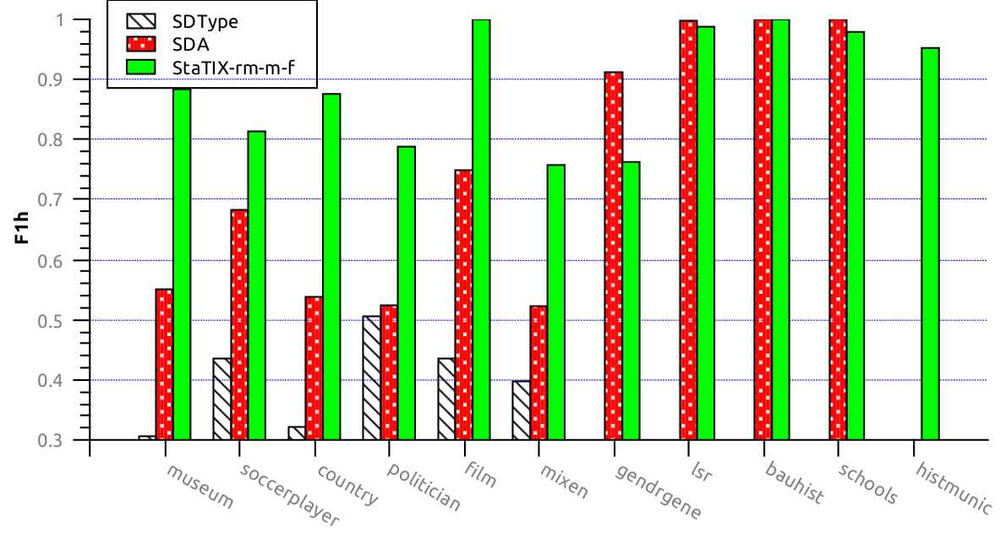
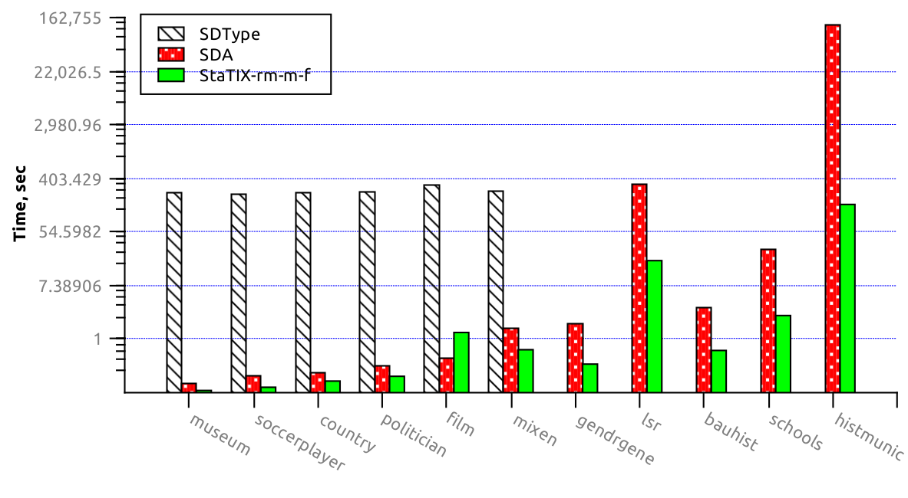

# StaTIX
Statistical Type Inference (both fully automatic and semi supervised) for RDF datasets in the N3 or N-Quads format.

\cite: [StaTIX — Statistical Type Inference on Linked Data](https://github.com/eXascaleInfolab/StaTIX/blob/master/docs/statix.pdf)
```bibtex
@inproceedings{Stx18,
  title={StaTIX — Statistical Type Inference on Linked Data},
  author={Artem Lutov and Soheil Roshankish and Mourad Khayati and Philippe Cudré-Mauroux},
  booktitle={IEEE BigData 2018 - 4th Special Session on Intelligent Data Mining},
  doi={10.1109/BigData.2018.8622285}
  year={2018}
}
```
The StaTIX *Java client application* was initially developed in the scope of the [Master Project](https://goo.gl/tznYeL) of [Soheil Roshankish](http://unibe-ch2.academia.edu/SoheilRoshankish/CurriculumVitae).

\authors: (c) Artem Lutov <artem@exascale.info>, Soheil Roshankish  
\organization: [eXascale Infolab](http://exascale.info/)  
\license:  [Apache License, Version 2.0](https://www.apache.org/licenses/LICENSE-2.0)  


## Content

- [Overview](#overview)
- [Requirements](#requirements)
- [Usage](#usage)
- [Related Projects](#related-projects)

## Overview

StaTIX performs *statistical type inference for the RDF datasets* in fully automatic fashion with possibility to use semi supervised mode. In the semi supervised mode, either *a)* the sample of the processing dataset *prelabeled with the type* properties should be provided, or *b)* another dataset should be specified with the present type properties and, desirably, similar structure to the processing dataset. The input RDF dataset(s) should be specified in the [N3](https://www.w3.org/TeamSubmission/n3/)/[N4 (N-Quads)](https://www.w3.org/TR/n-quads/) formats: `<subject> <property> <object> .`.  
Types (rdf objects, which correspond `rdf:type` predicate value) are inferred as clusters of the RDF triple subjects in the scope of the whole input dataset with *automatic scale identification for each cluster*. The *scale* for all clusters can be manually forced in case specific macro or micro level clustering is required.  
For the semi supervised mode, similarity between the RDF subjects is evaluated with respect to the #type properties using *TF-IDF based similarity weighting* for the weighted *cosin similarity*.

> Currently StaTIX infers semantic types based only on the statistical analysis of the input dataset. The accuracy can be improved further with additional semantic analyses leveraging both logical inference and embedding techniques to better grasp the differences and relationships between various instances.

The output results are clusters in the [.cnl format](https://github.com/eXascaleInfolab/PyCABeM/blob/master/formats/format.cnl) (space separated list of members). Each cluster correspond to the type and has members represented by the subject ids. Subject ids are generated sequentially starting from `0` for all unique subjects in the input dataset.

### Evaluation of the StaTIX type inference (see details in [TInfES](https://github.com/eXascaleInfolab/TInfES))
StaTIX is executed as `./run.sh -f -m -r m -o <outp_cls> <inp_dataset>` and compared with [SDA](https://link.springer.com/chapter/10.1007/978-3-319-25264-3_36) and [SDType](http://www.heikopaulheim.com/docs/iswc2013.pdf).

**Accuracy** (the higher, the better):

**Execution time** (the lower, the better):


## Requirements
*StaTIX* uses *DAOC* clustering library and *Apache [Commons CLI](https://commons.apache.org/proper/commons-cli/)* arguments parser. Both libraries are included into the repository and located in the `/lib` dir.  
*Java 1.8* is required to compile (JDK) or execute (JRE) *StaTIX*, on Linux Ubuntu Java can be install executing: `$ sudo apt-get install openjdk-8-jdk-headless`. On other platforms Java can be downloaded from the [OpenJDK](http://openjdk.java.net/install/) or [Oracle](http://www.oracle.com/technetwork/java/javase/downloads/index.html) sites.

*DAOC* is a C++ clustering library with [SWIG](http://www.swig.org/)-generated Java interface. The provided native library (`libdaoc.so`) is built on *Ubuntu 16.04 x64* (and might also work in the [Ubuntu console of Windows 10 x64](https://www.windowscentral.com/how-install-bash-shell-command-line-windows-10)). *DAOC* should be rebuilt from the sources to run *StaTIX* on other platforms.

## Usage

```
./run.sh  -h
Usage: ./run.sh [OPTIONS...] <inputfile.rdf>
Statistical type inference in fully automatic and semi supervised modes
Options:
 -b,--brief-hints <arg>           Brief hits, possible values:
                                  '--'  - interactive hints
                                  '<filename.ipl>'  - read from the file
                                  having the format for each line:
                                  <indicativity> <property>
                                  where indicativity E [0, 1]; 0 - the
                                  property has no any impact on the entity
                                  type, 1 - the property fully specifies
                                  the entity type, line comments starting
                                  with '#' are allowed.
                                  '-[<nopts=INF>]'  - automatic generation
                                  of the hints to the <inpfile_marks.ipl>,
                                  where <marks> is the range of marks (>=
                                  1) on supervision, which defines the
                                  indicativity precision eps=0.5/(marks +
                                  1): eps=0.167 for 2 marks
 -c,--cut-ratio <arg>             Cut the graph links (similarity matrix)
                                  iteratively on the graph construction
                                  before the construction is completed
                                  discarding instance (node) links lighter
                                  than cut-ratio * avg_ndlinks_weight,
                                  cut-ratio E [0, 1), recommended value if
                                  applied: ~0.25, 0 means skip the
                                  cutting. Reduces the memory consumption
                                  and speedups the clustering but affects
                                  the accuracy
 -e,--extract-groundtruth <arg>   Extract ground-truth (ids of the
                                  subjects per each type) to the specified
                                  file in the .cnl format, optionally with
                                  subjects and type labels
 -f,--filter                      Filter out from the resulting clusters
                                  all subjects that do not have the
                                  '#type' property in the input dataset,
                                  used for the type inference evaluation
 -g,--groundtruth-sample <arg>    The ground-truth sample (subset of the
                                  input dataset or another similar dataset
                                  with the specified type properties)
 -h,--help                        Show usage
 -j,--jaccard-similarity          Use (weighted) Jaccard instead of the
                                  Cosine similarity
 -l,--cl-label <arg>              Output map of the cluster labels (names)
                                  (<inpfile>.clb in the label per line
                                  format, default: disabled, requires: -e
 -m,--multi-level                 Output type inference for multiple
                                  scales (representative clusters from all
                                  hierarchy levels) besides the macro
                                  scale (top level, root)
 -n,--id-name <arg>               Output map of the instance id names
                                  (labels) to the <inpfile>.idm in tab
                                  separated format: <id> <subject_name>,
                                  default: disabled. Note: all instances
                                  are mapped including non-typed ones
 -o,--output <arg>                Output file, default: <inpfile>.cnl
 -p,--network <arg>               Produce .rcg input network file for the
                                  clustering without the type inference
                                  itself and respecting the "cut-ratio",
                                  "filter", "weigh-instance" and
                                  "jaccard-similarity" options
 -r,--reduce <arg>                Reduce graph links (similarity matrix)
                                  on the graph clustering (after the graph
                                  is constructed) by non-significant
                                  relations to reduce memory consumption
                                  and speedup the clustering (recommended
                                  for large datasets). Options X[Y]; X: a
                                  - accurate, m - mean, s - severe; Y: o -
                                  use optimization function for the links
                                  reduction (default), w - reduce links by
                                  their raw weight. Examples: -r m, -r mw.
                                  Note: all non-zero unique items (half of
                                  the symmetric matrix) are supplied for
                                  the graph construction, which is the
                                  memory consumption bottleneck
 -s,--scale <arg>                 Scale (resolution, gamma parameter of
                                  the clustering), -1 is automatic scale
                                  inference for each cluster, >=0 is the
                                  forced static scale (<=1 for the macro
                                  clustering); default: -1
 -u,--unique-triples              Unique triples only are present in the
                                  ground-truth dataset (natty, clean data
                                  without duplicates), so there is no need
                                  of the possible duplicates
                                  identification and omission
 -v,--version                     Show version number
 -w,--weigh-instance              Weight RDF instances (subjects, consider
                                  the self-relation) or use only the
                                  weighted relations between the instances
```
To infer types without the ground-truth available with the implicit output to the `inpDataset.cnl`: `./run.sh inpDataset.rdf`.  
To infer types with available ground-truth for the sampled reduced dataset or using another typed dataset with similar structure, performing output to the `results.cnl`: `./run.sh -g gtSample.rdf -o results.cnl inpDataset.rdf`.  
To infer types on multiple resolution levels (besides the whole dataset scope): `./run.sh -a inpDataset.rdf`.  
To produce the input network in the [.rcg format](https://github.com/eXascaleInfolab/PyNetConvert#rcg) for the clustering without the type inference itself: `$ ./run.sh -f -p networks/gendr-f.rcg datasets/biomedical/gendr.rdf`.

### Compilation

```
./build.sh [-p] [-c] [<outdir>]
  -p,--pack - build the tarball besides the executables
  -c,--classes  - retain classes after the build, useful for the frequent
    modification and recompilation of some files.
    
    Compilation or the single file (.java to .class):
    $ javac -cp lib/\*:src -d classes/ src/info/exascale/statix/main.java
```
The compilation requires JDK and verified on OpenJDK 8/9 x64.  
The build yields `statix.jar` with all requirements in the output directory (`.` by default) and optionally packs all these files to the tarball `statix.tar.gz`.

### Distribution

Compilation generates `statix.tar.gz` tarball with all requirements ready for the distribution. Also the tarball can be generated from the executables using the `pack.sh` script.

**Note:** Please, [star this project](//github.com/eXascaleInfolab/StaTIX) if you use it.

## Related Projects

- [TInfES](https://github.com/eXascaleInfolab/TInfES)  - Type inference evaluation scripts and accessory apps used for the StaTIX benchmarking.
- [xmeasures](https://github.com/eXascaleInfolab/xmeasures)  - Extrinsic clustering measures evaluation for the multi-resolution clustering with overlaps (covers): F1_gm for overlapping multi-resolution clusterings with possible unequal node base and standard NMI for non-overlapping clustering on a single resolution.
- [GenConvNMI](https://github.com/eXascaleInfolab/GenConvNMI) - Overlapping NMI evaluation that is (unlike `onmi`) compatible with the original NMI and suitable for both overlapping and multi resolution (hierarchical) clusterings.
- [OvpNMI](https://github.com/eXascaleInfolab/OvpNMI) - Another method of the NMI evaluation for the overlapping clusters (communities) that is not compatible with the standard NMI value unlike GenConvNMI, but it is much faster than GenConvNMI.
